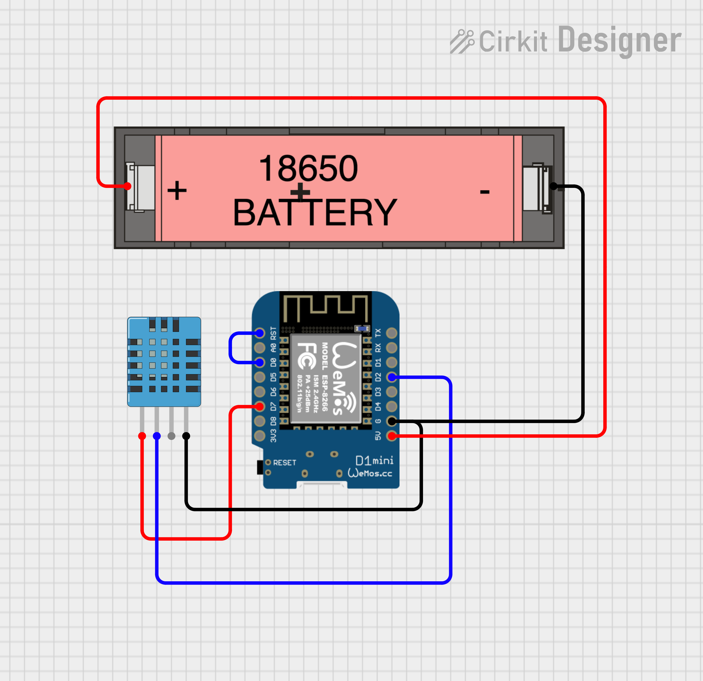

# Greenhouse Mote

A project to make a little wireless sensor for monitoring our greenhouse.

The platfrom is an ESP8266, specifically the D1 Mini, with a DHT11.

It reports over WiFi to a custom Cloudflare worker.

## TODO List

- [x] Get a sensor working
- [x] Confirm deep sleep works
- [x] Power via battery
- [x] Get TLS working
- [ ] Make a box for it
- [ ] Measure voltage of battery and report it

## Libraries

 - https://github.com/hasenradball/AM2302-Sensor
 - https://github.com/OperatorFoundation/Crypto

## Wiring

